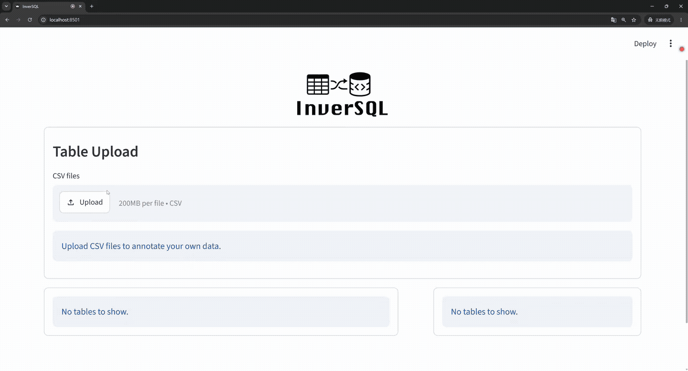
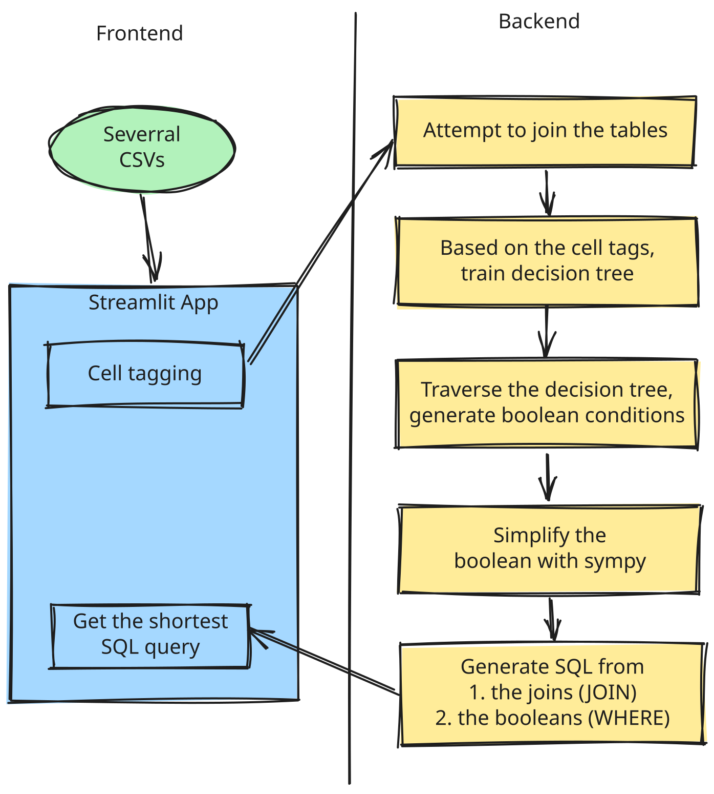

[][demo]

 <h1> 🔄 InverSQL </h1>

## Generate SQL that match a set of records by decomposing decision trees

1. User doesn't want to write SQL.
2. User uploads CSV to [inversql streamlit app][demo]
3. User selects cells (that will be selected by the SQL).
4. We **overfit** a `scikit-learn` binary decision tree on the data.
5. We decompose the tree, convert to boolean logic (explainable AI part).
6. We simplify the logic with `sympy`.
7. Generate SQL from previous steps (joins to JOIN and boolean to WHERE).
8. User sees the SQL.
9. User is happy.

<table>
  <tr>
    <th width="64%">🎬 Demo in a GIF</th>
    <th width="36%">🏛️ Architecture diagram</th>
  </tr>
  <tr>
    <td align="center">
        
      <figcaption>
        Link to
        <a href="https://inversql.streamlit.app">
          live demo site
        </a>
        here.
      </figcation>
    </td>
    <td align="center">
      
    </td>
  </tr>
</table>

### 🏎️ Performance

For each individual SQL query candidate (the shortest one is displayed in the UI), we need to retrain a new decision tree.

But...
The decision tree fitting is honestly fast, don't worry about this.

## 🌟 Give us a star!

That's pretty much it!

If you have read this far, please consider giving me a star (⭐) or a fork (🍴).

This will keep my motivation going!

Or if you have too much cash at hand: 

> If you **REALLY** like my work, nowadays I'm working on [`aioway`](https://github.com/rentruewang/aioway), it's an optimizing compiler approach to deep learning, check it out!

### 👨‍👨‍👦‍👦 Contributors

Contribution welcome!

To contribute, refer to [CONTRIBUTING.md](./CONTRIBUTING.md),
and our [CODE_OF_CONDUCT.md](./CODE_OF_CONDUCT.md).

### 🎨 Inspiration.

Inspired by [regexgen](https://github.com/devongovett/regexgen#how-does-it-work)'s process. Instead of regex we do SQL. Instead of selecting text we do select records. Decision tree is my inspiration tho.

[demo]: https://inversql.streamlit.app
